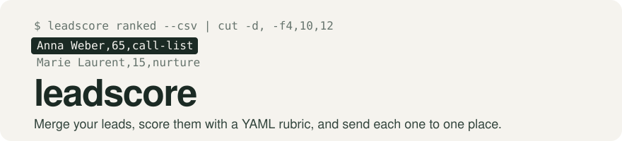

<picture>
  <source media="(prefers-color-scheme: dark)" srcset=".github/assets/banner-dark.svg">
  
</picture>


[](https://github.com/HarshitBadhwar8/leadscore/actions/workflows/ci.yml)
[](https://pkg.go.dev/github.com/HarshitBadhwar8/leadscore)
[](LICENSE)


A small sales team gets leads from many places: conference lists, a lead
sheet, website visits. Someone has to merge them, decide who is worth a call,
and make sure nobody who opted out or already replied gets cold email again.
leadscore does that on a schedule. It merges your leads into people, scores
them with a rubric you write in YAML, and sends each lead to one place: an
Apollo sequence, HubSpot, or a plain list you send from yourself.

Status: pre-release. Before v1, the `leadscore.yml` keys, the rubric format and the commands may
change, and [CHANGELOG.md](CHANGELOG.md) says how.

## Contents

- [What it does](#what-it-does) lists the commands and the plug-in API, and what leadscore does not do.
- [Quick start](#quick-start) scores the sample leads on your machine in a few minutes.
- [Words used here](#words-used-here) explains lanes, sinks, `do_not_contact` and the receiver.
- [Choosing a path](#choosing-a-path) maps what you have to one of three ways to run it.
- [Usage](#usage) sums up each path, the export lists, and how to check on a running install.
- [Reference](#reference) lists every command and the rules for enrichment, HubSpot and the receiver.
- [Before you rely on it](#before-you-rely-on-it) lists what is not yet checked against the real vendors, and other limits.
- [Project](#project) covers how it ships, versioning, tests, contributing and the license.

## What it does

leadscore is one binary. Each run reads your leads, merges rows that are the
same person, scores every lead, and sends each to at most one lane. It also
reads replies and opt-outs back, so it never cold-contacts an opted-out person
or anyone twice.

- `leadscore run` does one run. Leads come from CSV files, Google Sheet tabs
  and Apollo webhooks. Results go to Apollo sequences, HubSpot contacts and
  deals, or export lists (a CSV file or a Sheet tab).
- `leadscore run --dry-run` prints what a run would change, and writes and
  spends nothing.
- `leadscore serve` is the receiver for Apollo's webhooks: replies, opt-outs
  and website visits. With `--every` it also runs on a timer.
- `leadscore doctor` and `leadscore status` check the install and print each
  problem with its fix.
- `leadscore ranked` and `leadscore explain` show every lead's score and the
  reasons behind it.
- The module root is a Go package, `leadscore`. A custom build can add its own
  source, store or sink as a plug-in ([Plug-ins](docs/reference.md#plug-ins)).

What it does not do:

- It sends no email itself. Apollo, HubSpot or your own tool sends.
- It finds no new leads. You bring them, and Apollo can fill in company facts.
- It has no alerting in v1. Someone has to look ([Health, status and doctor](#health-status-and-doctor)).
- It has no web interface. With a Google Sheet as the store, the Sheet is the interface.

## Quick start

You need Go 1.25 or later and a terminal on macOS, Linux or Windows (WSL).
No account or key is needed: this scores the made-up leads in
`examples/leads.csv` with the example rubric and writes the lists.

```sh
git clone https://github.com/HarshitBadhwar8/leadscore.git
cd leadscore
go build -o leadscore ./cmd/leadscore
mkdir -p try
cp examples/leads.csv try/leads.csv
cp examples/rubric.csv-only.yml try/rubric.yml
cd try
cat > leadscore.yml <<'EOF'
version: 1
store: { type: sqlite, path: leadscore.db }
sources:
  - { id: leads, type: csv, path: leads.csv }
export: { dir: out }
EOF
../leadscore run
../leadscore ranked --csv | cut -d, -f4,10,12
ls out
```

```text
run <run id>: healthy; 8 lead(s) scored, 8 input row(s) merged, 0 left for later runs, 0 pushed
full_name,score,lane
Anna Weber,65,call-list
Jonas Brandt,60,call-list
Lea de Vries,50,call-list
Pia Schulz,50,call-list
Ines Ruiz,40,call-list
Marie Laurent,15,nurture
Tom Hale,0,
Sam Ortiz,0,
call-list.csv
nurture.csv
```

Each run has its own id. The example rubric has two export lanes, so there
are two lists in `out/`. Tom Hale and Sam Ortiz work at companies the rubric
rules out, so they are on no list.

Before you email anyone on a list, drop rows where `do_not_contact` is `yes`.

To see why a lead scored as it did, run
`../leadscore explain anna.weber@kranlogistik.example`. Edit `rubric.yml`
and run again to see the ranking change. When you are ready for your own
leads, pick a path in [Choosing a path](#choosing-a-path).

## Words used here

- **Lane:** where a lead goes, set in your rubric. Each lead goes to at most
  one lane per run.
- **Cold lane:** first outreach to someone who has not talked to you (an
  Apollo sequence, a new HubSpot contact). A person gets a cold push once,
  ever.
- **Sink:** a tool a lane pushes to: Apollo or HubSpot, set up in the
  `sinks` block of `leadscore.yml`.
- **Export lane:** a lane that only keeps a list (a CSV file or a Sheet tab)
  for you to send from your own tool. It pushes nothing.
- **`do_not_contact`:** a column on every export list. `yes` means do not
  email this person. [Export lists](#export-lists) says when it is `yes`.
- **Receiver:** the always-on web address Apollo sends replies, opt-outs and
  website visits to (`leadscore serve`).

## Choosing a path

| You have | Use | Example |
|---|---|---|
| A CSV of leads, and you want scored lists to send from yourself | [Path 1: CSV only](#path-1-csv-only) | [leadscore.csv-only.yml](examples/leadscore.csv-only.yml) |
| A Google Cloud project with billing, and a team that works in a Google Sheet | [Path 2: Google Cloud](#path-2-google-cloud) | [leadscore.gcp.yml](examples/leadscore.gcp.yml) |
| A server with a domain, for live Apollo webhooks | [Path 3: Docker](#path-3-docker) | [leadscore.server.yml](examples/leadscore.server.yml) |
| A laptop, to try it with Apollo or HubSpot | [Path 3: Docker](#path-3-docker) | [leadscore.laptop.yml](examples/leadscore.laptop.yml) |

Not sure? Start with **CSV only**. It takes ten minutes, needs no accounts,
and every other path builds on it. Every path needs someone comfortable with
a terminal for setup.

On every path, runs start with **pushes off**. leadscore scores and lists,
a person reviews a dry run, and only then turns pushing on.

**There is no alerting in v1, on any path.** Nobody is emailed or messaged
when a run fails. Someone has to look (`leadscore status`, the `Health` tab,
`docker ps`), or point an uptime monitor at the receiver's `/healthz`.

## Usage

[docs/setup.md](docs/setup.md) has the full runbook for each path, step by
step. Each step says whether an agent or a person does it, so a coding agent
can follow it too. Install the CLI from the
[Releases page](https://github.com/HarshitBadhwar8/leadscore/releases), or
build it from source with Go 1.25 or later
([Install the CLI](docs/setup.md#install-the-cli)).

### Path 1: CSV only

When: you want scored lists from CSV files, with no vendor account.

Copy `examples/leadscore.csv-only.yml` and `examples/rubric.csv-only.yml`
beside your CSV, write the rubric, and run `leadscore run`. It runs as the
plain binary or on Docker. The full steps are in
[Path 1: CSV only](docs/setup.md#path-1-csv-only).

Remember:

- **Keep the example's export lanes only.** A cold lane claims the leads it
  matches even with no sink set up, so they show `do_not_contact: yes`.
- **Filter on `do_not_contact` before every send.**

### Path 2: Google Cloud

When: you want runs on a schedule with nothing on your own machine, and a
Google Sheet as the store.

The receiver runs as a Cloud Run service, and each run as a Cloud Run job
that Cloud Scheduler starts. `setup/gcp.sh` creates the accounts, the lease
bucket, the secrets, the deploy and the schedule, one step at a time. The
full steps are in [Path 2: Google Cloud](docs/setup.md#path-2-google-cloud).

Remember:

- **The spreadsheet holds personal data.** Share it only with named people,
  never by link.
- **Nothing alerts you when a run fails.** Set an uptime monitor on
  `<public_url>/healthz`.

### Path 3: Docker

When: you have a server with a domain for live webhooks, or a laptop to try
it on.

One container runs the receiver and a run every `schedule`, with SQLite on a
named volume. `compose.yaml` runs the release image
`ghcr.io/harshitbadhwar8/leadscore:v0.1.0-rc.1`. Before a release image
exists, build it yourself with `docker build -t leadscore .` and set
`LEADSCORE_IMAGE=leadscore` in `.env`. The full steps are in
[Path 3: Docker](docs/setup.md#path-3-docker-a-laptop-or-a-server).

Remember:

- **A laptop has no public address.** It polls Apollo for replies, or uses a
  Cloudflare Tunnel that works only while the laptop is awake.
- **Nothing alerts you when a run fails.** Set an uptime monitor on
  `<public_url>/healthz`.

### Export lists

An `export` lane in the rubric keeps a list instead of pushing to a tool.
Each lane gets one table (`Export <lane id>`, a tab on a Sheets store). On
SQLite it also gets one CSV in `export.dir` (`./out` on Docker), rewritten
after every run.

- A lead is listed once, the first run it matches. A run adds at most
  `ingest_chunk_rows` (2,000) new rows across all lists, and the rest follow
  in later runs. Every run refreshes each row's `status` and
  `do_not_contact`, also for lanes since removed from the rubric.
- **Filter on `do_not_contact` before every send.** It is `yes` when the
  lead opted out or is blocked, is at a company with an open or won deal,
  was already contacted, or matches a cold lane. Opt-outs reach the lists
  from the receiver, polling and `Overrides`. The Apollo and HubSpot opt-out
  lookups run only for leads about to be pushed.
- A cold lane claims its leads even before its sink is set up, so anyone it
  matches is `do_not_contact`. A CSV-only team removes the cold lanes from
  its rubric (`doctor` warns `cold_lane_no_sink:<lane>`).
- A cell that a spreadsheet would read as a formula (starting with `=`, `+`,
  `-` or `@`) is quoted with a leading `'` in the CSV files and in
  `ranked --csv` and `facts --csv`. So opening them in Excel or Sheets
  never runs a formula a lead's data carried.
- CSV files are written only for a SQLite store, with mode 0600, because they
  hold personal data. A plug-in store (for example Postgres,
  `docs/postgres-store.md`) keeps its lists as tables in that store.

### Health, status and doctor

- `leadscore status` prints the last run's result and every open problem,
  each with its fix.
- `leadscore doctor` prints one line per check, each problem with its fix.
  It exits 0 when nothing fails (warnings allowed) and 1 otherwise. It only
  reads: it never writes the store or takes the lease. The checks are listed
  in [docs/reference.md](docs/reference.md#doctor-checks).
- With a Google Sheet as the store, the `Health` tab's cell `H1` reads
  `STALE` (in red) when no run has succeeded in three `schedule` intervals.
- On Docker, `docker ps` shows the container unhealthy when `/healthz`
  answers 503 (see "Health check" in [The receiver](#the-receiver)).
- `SKILL.md` has a troubleshooting entry for every doctor check, and the loop
  for changing the rubric safely.

## Reference

[docs/reference.md](docs/reference.md) has the exact formats: the rubric,
`leadscore.yml`, the store tables, the receiver, the doctor checks, hosting
and the plug-in interfaces. This section covers what you need while setting
up.

### Commands

`leadscore help` lists every command, and `leadscore <command> --help` shows
one command's flags. `leadscore version` prints the version.

- `leadscore run [--dry-run]` does one run. It reads `leadscore.yml` and the
  rubric fresh, and takes the run lease (if another run holds it, this one is
  skipped). It merges new input rows, `ingest_chunk_rows` per run, so a large
  first import finishes over several runs and nothing is pushed until it has.
  Then it scores every lead and saves `Ranked` and `Health`. It exits 1 when
  the run failed or finished unhealthy.
- With `--dry-run` it prints one line per lead whose verdict, status or
  planned lane would change, then totals, and ends with a summary
  line starting `dry run` (it says nothing was saved or pushed). It takes no lease, writes nothing and spends nothing. On a first
  install its lead ids are temporary, so after a run look leads up by email
  (`leadscore explain <email>`) or take ids from `leadscore ranked`.
- `leadscore serve [--every [interval]]` is the receiver for Apollo webhooks
  and `/healthz`. With `--every` it also runs the loop: once at start, then
  each `interval` (or `schedule`, read at start) after the previous run
  ended, so runs never overlap. On SIGTERM it lets a running run save,
  stores every webhook it accepted, and exits.
- `leadscore doctor` and `leadscore status`: see
  [Health, status and doctor](#health-status-and-doctor).
- `leadscore ranked [--csv]` prints every lead's verdict, highest score first.
- `leadscore facts [--csv]` prints every company's stored facts (value,
  origin, the value a change replaced) and when Apollo was last asked, by
  domain. With `--csv`, it writes the `Company facts` table's own columns. It
  only reads.
- `leadscore explain <person>` prints one lead's verdict and the reasons
  behind it.
- `leadscore healthz` calls the local `/healthz` (the compose health check).
- `leadscore rules check <file>` compiles a rubric and lists every error.
- `leadscore config get <key>`, `config set-hosting k=v...` and `config push`
  read a value, write the `hosting` block, and upload the hosted bundle.
- `leadscore setup sheet [--view] [--repair]` and `leadscore setup hubspot`
  set up the spreadsheet and HubSpot.

The Overrides writers edit the `Overrides` table the same way on every
store. A person is an email, a LinkedIn URL or a lead id. A row for someone
not yet imported waits until they appear.

- `leadscore set-status <person> <status|none|resubscribe>` replaces the
  person's manual status (`replied_*`, `unsubscribed`, `blocked`), removes
  it, or undoes a manual `unsubscribed`.
- `leadscore merge <person> <person>` says the two are one person. The next
  run merges them for good.
- `leadscore mark-distinct <person> <person>` says two people who share a
  company and a name are different people.
- `leadscore retry [--lane <id>] [<person>]` retries failed pushes, for one
  person or everyone, in one lane or all.

### The rubric

Your ideal customer is one YAML file, the rubric. It says which columns
matter, how to label each company and person (tier, priority, ...), how to
score them, and where each lead goes. Start from `examples/rubric.yml`
(Apollo and HubSpot lanes) or `examples/rubric.csv-only.yml` (lists only).
The full format is in [`docs/reference.md`](docs/reference.md#the-rubric).

Check a rubric with `leadscore rules check rubric.yml`, which lists every
problem with its line. `SKILL.md` has the loop for changing it safely.

### Enrichment

With an `enrich` block, each run looks up company facts in Apollo for the
companies of your leads, using `APOLLO_API_KEY`. The facts are name,
headcount, funding stage, country and latest funding date.

```yaml
enrich: { type: apollo, max_age: 30d, max_lookups_per_run: 100, max_lookups_per_day: 400 }
```

- A company is looked up when it has never been, or when its last lookup (or
  Apollo's "not found") is older than `max_age`.
- Every call counts toward both budgets. So a large first import spreads over
  several days instead of spending a month of credits at once.
- Your `Companies` tab always wins over Apollo, and Apollo's value wins over
  a value from a lead sheet. When a value changes, the old one is kept in
  `Company facts` as `previous`.
- A dry run makes no lookups. A lookup that gets no answer waits a day, and
  three in a row stop enrichment for that run (the warning `enrich_failed`).
- The `apollo-key` check signs in with Apollo's free auth-health call on
  every run, so a bad key shows in `Health` without spending a credit.

### HubSpot

Add a `sinks.hubspot` block and set `HUBSPOT_TOKEN` to a private app's token:

```yaml
sinks:
  hubspot: { pipeline: Sales Pipeline, stage: Appointment scheduled }
```

`leadscore setup hubspot` creates the custom properties (`leadscore_lead_id`
and friends, in a `leadscore` group) and checks that the pipeline and stage
exist. Run it once, and again after changing `property_prefix`. It needs the
schema write scopes. Runs need contacts and deals read and write, companies
read, and schema read.

- A lane pushing to `hubspot:contacts` finds or creates the person's
  contact.
- A lane pushing to `hubspot:deals` also opens one deal per company (named by
  its domain), or adds the contact to the company's open deal.
- Before every push, leadscore reads HubSpot for the leads it may push. A
  contact that opted out of email makes the lead `unsubscribed`. A company
  with an open or won deal keeps its people out of cold lanes until the deal
  is closed lost.

### The receiver

`leadscore serve` accepts Apollo workflow requests at `POST /apollo/reply`
(sent, replies, opt-outs) and `POST /apollo/visit` (website visits), with
bodies from the templates in `setup/apollo/`. Each request carries the
receiver secret in the `X-Leadscore-Secret` header. When Apollo cannot set
headers, it can go in a top-level `leadscore_secret` body field instead,
which is removed before storing.

Prefer the header. The receiver reads at most 16 body-secret requests at a
time, so many slow ones can make the next one get 503. Requests with the
secret in the header never wait.

- The receiver answers 200 only once the event is stored. A wrong or missing
  secret gets 401. A request it could not store within 10 seconds gets 503,
  so Apollo can send it again. A repeated event is counted once.
- An opt-out or reply stored while a run is pushing still counts. Before
  each batch of 25 pushes, the run reads the newly stored events, so the
  person is not pushed in the next batch.
- Every opt-out and reply is kept in `Outcomes`, so it holds long after the
  90-day event window.

[docs/reference.md](docs/reference.md#receiver) lists every route and answer.

**Silence.** Reachable is not delivering. When the receiver is set up
(`receiver.public_url` is set), each run checks that every event kind it
expects arrived within `silence_threshold` (3 days by default). That means
`sent` with `replies: receiver`, and each `receiver.visit_events` kind. A
silent kind shows in `Health` as `silent:<kind>` and makes the run
unhealthy, so check that Apollo workflow. Without `receiver.public_url`,
silence is not watched, and `doctor` says so (`receivers:no_public_url`).
`doctor` also calls `<public_url>/healthz` to check Apollo can reach the
receiver.

**Receiver-only leads.** A lead known only from webhooks could be forged by
anyone with the secret. When a lane pushes one, `Health` shows the warning
`receiver_only_push:<lead>` until a source (a CSV or Sheet tab) reports that
person too. Cold lanes should require `receiver_only` to be false.

**Health check.** With the timer (Docker), `/healthz` is 200 while the last
run succeeded or none is due yet. It is 503 when the last run failed, none
succeeded in three intervals, or the store cannot be read. Without the timer
(Google Cloud) it is 200 unless storing events fails.

#### Keep the receiver secret private

The receiver secret (`LEADSCORE_RECEIVER_SECRET`) works like a password:
anyone who has it can send fake events, including a fake positive reply that
a deal lane would act on. Never paste it into chat, tickets or shared docs.
Type it only into `.env` (or Secret Manager) and the Apollo workflows, and
rotate it if it might have leaked. Without it every webhook is refused, while
`/healthz` and the timer keep working.

Make a new secret with `openssl rand -hex 32`. To rotate it on Docker, move
the current value to `LEADSCORE_RECEIVER_SECRET_PREVIOUS` in `.env` and set a
new `LEADSCORE_RECEIVER_SECRET`. Run `docker compose up -d`, update each
Apollo workflow, then remove the previous value and run
`docker compose up -d` again. Both are accepted in between, so no webhook is
lost. On Google Cloud, follow "Rotating a secret" in
[Path 2](docs/setup.md#path-2-google-cloud).

## Before you rely on it

These limits matter before you push to real people or send from a list.

### Not yet checked against live Apollo and HubSpot

The tests run against fake Apollo and HubSpot APIs. Some of the fakes' answers
were recorded from a real Apollo account, and the rest follow the vendors'
docs.

**Recorded from real Apollo calls (read only):**

- the sign-in check and a refused key
- the mailbox list and the sequence search
- the reply search: its date filter, paging and fields
- the error answer for an unknown contact

**Not yet checked against a real account:**

- **Apollo writes.** Creating a contact and adding it to a sequence (the
  call, its flags, re-adding, and the reasons Apollo skips a contact) follow
  Apollo's docs. No real answer was recorded.
- **Apollo details.** Whether the contact search spends credits, a real
  rate-limit (429) answer, and five of the eight documented reply labels.
- **Apollo workflow retries.** Whether Apollo resends a webhook that failed is
  unknown. If it does not, an event answered 503, or sent while the receiver
  was down or a laptop slept, is lost. Silence detection notices a workflow
  that goes quiet, not a single lost event.
- **HubSpot.** Every call. The HubSpot sink and its lookups are tested only
  against fakes built from HubSpot's docs.
- **Google Cloud.** The live check has not run on a billed project.

Before the first real push, review a dry run, and push to a small test
sequence or a test HubSpot pipeline first.

### Opt-outs

**Can contact someone who opted out (harmful):**

- **If you send only through Apollo:** leadscore does not yet know whether
  Apollo's contacts carry an opt-out flag it can read. Until that is
  confirmed, a person who clicked an unsubscribe link without replying may
  not be seen before a push. That is safe only if HubSpot is also a sink, or
  the receiver gets Apollo's `unsubscribed` webhook. The `apollo-key` check
  warns (`apollo-key:no_optout_flag`) until an unsubscribe webhook has been
  received.
- **Export lists** see opt-outs only from the receiver, polling and
  `Overrides`, as [Export lists](#export-lists) says.

**Blocks someone it could contact:** a lead at a company with an open or won
HubSpot deal stays out of cold lanes until the deal is closed lost. This is
by design.

### Monitoring, volume and cost

- **No alerting in v1.** A failed run tells nobody. See
  [Choosing a path](#choosing-a-path) for what to watch.
- **Polled replies** are found by the date their email was sent. A reply that
  comes more than `sequence_length` plus `window_margin` (37 days by default)
  after its email is missed.
- **A Google Sheet holds 10 million cells.** At the design target (20,000
  leads, about 1,000 receiver events a day) a Sheets store uses about 6
  million. `doctor` warns at 70% (`sheets:cells`) and names the largest tabs.
  **Above about 1,500 events a day, use SQLite (Docker), or shorten
  `log_retention`.** An export tab holds up to 20,000 rows in that budget.
- **Apollo limits** on the account checked were 200 calls a minute, 400 an
  hour and 2,000 a day for each endpoint. The default enrichment budgets
  (100 lookups a run, 400 a day) stay inside them.
- **Run time and monthly cost** on Google Cloud are not measured yet.

## Project

### Layout

| Path | What lives there |
|---|---|
| module root (package `leadscore`) | the public API: plug-in interfaces, types, errors, the adapter registry, `Run`, `Main` |
| `cmd/leadscore/` | the CLI binary |
| `internal/api` | the public types (re-exported by the root), the built-in header aliases |
| `internal/config` | loading `leadscore.yml`, `config get`, `config set-hosting` |
| `internal/check` | the `doctor` check framework and the checks |
| `internal/cli` | the commands, `doctor` among them |
| `internal/model` | the in-memory model of the store's tables |
| `internal/store/codec` | maps the model to table writes, loads a store and checks its schema version |
| `internal/store/sqlite` | the built-in SQLite store (WAL, lease row, event log) |
| `internal/store/sheets` | the built-in Google Sheets store (one batchUpdate per commit, monthly `Events` tabs, Cloud Storage lease file) and `setup sheet` |
| `internal/fakes/sheets`, `internal/fakes/gcs` | in-memory fakes of Google Sheets, Drive and Cloud Storage for tests |
| `internal/rules` | the rubric compiler and evaluator: YAML rules compiled to CEL |
| `internal/merge` | turns input rows into one lead per person: header aliases, identities, `same_as` merges, the Overrides tab |
| `internal/receiver` | `leadscore serve`: the Apollo webhook receiver, its write queue, `/healthz` and the Docker run timer |
| `internal/receiver/auth` | the constant-time secret check |
| `internal/engine` | the run: lease, sources and chunked merge, scoring, the two saves, `Ranked`, `Health`, lanes and the ledger, export lists and their CSVs, the Sheet view |
| `internal/logredact` | log redaction: logs carry ids, never emails |
| `internal/csvsafe` | quotes CSV cells a spreadsheet would read as formulas |
| `internal/hosting` | Google Cloud: the fixed resource names, Secret Manager reads and writes (`config push`, hosted keys), the schedule's cron form, and the reads behind the `hosting` check |
| `internal/fakes/gcp` | an in-memory fake of Secret Manager, Cloud Run, Cloud Scheduler and Artifact Registry for tests |
| `adapters/csv` | the CSV file source (`type: csv`): lead rows, or event rows with `events: true` |
| `adapters/sheetsource` | the Google Sheet tab source (`type: sheetsource`): tabs of the team's spreadsheet |
| `adapters/apollo` | the Apollo client, enrichment, sequences sink, opt-out lookup and reply poller |
| `adapters/hubspot` | the HubSpot sink (`hubspot:contacts`, `hubspot:deals`), the opt-out and deal lookup, `setup hubspot` and the `hubspot` check |
| `internal/fakes/hubspot`, `internal/fakes/apollo` | fake vendor APIs for tests, held to the fixtures in `testdata/vendors` |
| `storetest/`, `sinktest/` | conformance suites for plug-in stores and sinks |
| `examples/` | made-up example rubrics (`rubric.yml`, and `rubric.csv-only.yml` with export lanes only), a sample lead sheet (`leads.csv`), and example `leadscore.yml` files for CSV only, Docker on a laptop and on a server, and Google Cloud |
| `compose.yaml`, `Dockerfile` | the Docker setup: the image and the compose file that runs it |
| `setup/apollo/` | the Apollo workflow templates the receiver accepts |
| `setup/gcp.sh` | the Google Cloud setup script, one subcommand per runbook step |
| `SKILL.md` | for agents running an install: the rule-change loop and one troubleshooting entry per doctor check |
| `docs/setup.md` | the setup runbook for each path |
| `docs/reference.md` | the exact formats: rubric, `leadscore.yml`, store tables, receiver, doctor checks, hosting, plug-in interfaces |
| `docs/postgres-store.md` | how to write a Postgres store as a plug-in |
| `docs/adr/` | the decision records behind the receiver, the two-phase saves and the push ledger |

### How it ships

Each release is a `v*` tag. The release workflow tests the tagged commit,
then publishes two things:

- A GitHub release on the [Releases page](https://github.com/HarshitBadhwar8/leadscore/releases),
  with archives for Linux, macOS and Windows on amd64 and arm64. Each archive
  holds the `leadscore` binary, `LICENSE`, `NOTICE` and the third-party
  licenses. A `checksums.txt` lists their hashes.
- The container image `ghcr.io/harshitbadhwar8/leadscore:<version>` for
  linux/amd64 and linux/arm64. A final version also moves `latest`, and a
  pre-release tag such as `v0.1.0-rc.1` does not.

### Versioning and compatibility

Releases follow semantic versioning. The first release is `v0.1.0-rc.1`, a
pre-release. Before v1, a minor release may break the `leadscore.yml` keys,
the rubric format or the commands. [CHANGELOG.md](CHANGELOG.md) lists every
change by release.

- The plug-in interfaces never gain methods after v0.1.0. A new capability
  is a separate optional interface.
- A new version changes the store only by adding tables or columns. An older
  version runs on a store a newer minor version extended, and only a newer
  major version is refused.
- Go 1.25 is the floor, and CI tests Go 1.25, 1.26 and 1.27. The linter
  needs Go 1.26 or later.

### Tests

The suite covers the rubric compiler, merging, every store against the
conformance suites, the sinks against fake Apollo and HubSpot APIs, the
receiver, the doctor checks and the commands. It needs no key or account.

```sh
go build ./...
go vet ./...
go test -race ./...
```

CI also runs `setup/gcp.sh` against a fake `gcloud` (`testdata/gcloud/gcloud`),
builds the image for both architectures, and runs `docker compose up` with a
timer run end to end (`testdata/compose/smoke.sh`).

The live checks talk to real services and are skipped unless their variable
is set:

| Variable | What it checks |
|---|---|
| `LEADSCORE_LIVE_APOLLO` | Read-only calls against a real Apollo account. It names an env file holding `APOLLO_API_KEY` and `APOLLO_MAILBOX_ID`. It never writes, and keeps raw answers outside the repository. |
| `LEADSCORE_LIVE_SHEETS` | Saves 20,000 leads and a year of events to a scratch spreadsheet and loads them within a minute. Set it to `1` or the path of a service-account key file. Your own gcloud login (or the account `LEADSCORE_LIVE_SHEETS_OWNER` names) creates the spreadsheet, so it needs `gcloud auth login --enable-gdrive-access`. |
| `LEADSCORE_LIVE_CLOUDRUN` | Sets up a billed, throwaway project with `setup/gcp.sh` and the image in `LEADSCORE_LIVE_IMAGE`. The project is `LEADSCORE_LIVE_PROJECT`, never one a real install uses, and it refuses any project listed in `LEADSCORE_LIVE_DENY_PROJECTS`. It starts a run longer than 3 minutes from Cloud Scheduler, posts webhook bursts during the run and during a redeploy, and checks no event was lost. Its comment lists what to do first. |

### Contributing, security and license

- Contributions are welcome. See [CONTRIBUTING.md](CONTRIBUTING.md) and the
  [CODE_OF_CONDUCT.md](CODE_OF_CONDUCT.md).
- Report a vulnerability privately through the repo's [Security tab](https://github.com/HarshitBadhwar8/leadscore/security).
- Licensed under the [MIT License](LICENSE).

Copyright 2026 Workloom Solutions Private Limited.

[CONTRIBUTORS.md](CONTRIBUTORS.md) lists everyone who wrote the code, and the
AI coding agents used on it.
